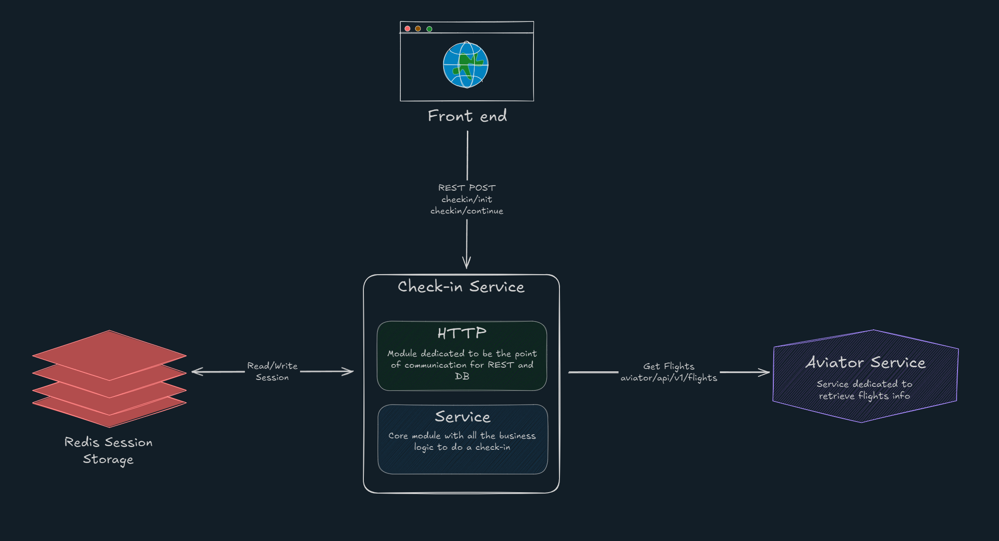

# Aterrizar Punto Com - Check-in Microservice

## Overview

This project is a microservice developed for **Aterrizar Punto Com**, a fictional airline company. The microservice is responsible for managing the **check-in process** for flights, ensuring a smooth and efficient experience for users. It is built using **Java**, **Spring Boot**, and **Gradle**, and is designed to integrate seamlessly within a microservices architecture.

### Purpose and Intent

The primary goal of this service is to handle the check-in process for passengers. It ensures that all required fields are provided, validates the input data, and manages the session lifecycle for the check-in process. By isolating this functionality into a dedicated microservice, the system achieves better scalability, maintainability, and modularity.

### Modules

This project is divided into two main modules and one extra module for integration tests: 

1. **HTTP Module**:
    - **Purpose**: Handles the HTTP layer of the application, including request routing and API endpoints.
    - **Key Responsibilities**:
        - Exposes RESTful endpoints for session initialization and check-in requests.
        - Maps incoming HTTP requests to the appropriate service layer methods.
        - Handles request validation and error responses.

2. **Service Module**:
    - **Purpose**: Contains the core business logic and models for the check-in process.
    - **Key Responsibilities**:
        - Manages the session lifecycle and validates check-in requests.
        - Implements the business rules for the check-in process.
        - Provides services consumed by the HTTP module.

3. **Integration Module**:
   - **Purpose**: Contains integration tests to ensure the different parts of the application work together as expected.
   - **Key Responsibilities**:
     - Validates interactions between modules and external systems, and overall the REST API functionality.

### C4 Model Diagram 


### Pseudo-Class Diagram


## Service Module
The service module forms the core of the check-in microservice, encapsulating the primary business logic and data models. It is designed to operate independently of the HTTP layer, ensuring easier testing and maintainability.

This module leverages several design patterns to create a robust framework for managing the check-in process. It is structured to be both extensible and maintainable. The key components of this framework, located in `com.aterrizar.service.core`, include:

1. **Flow Execution**:
   - Represented by the `FlowExecutor` class and the `Step` interface, this component orchestrates the check-in process using the [Chain of Responsibility](https://refactoring.guru/design-patterns/chain-of-responsibility) pattern.

2. **Country-Specific Strategies**:
   - Defined by the `CountryStrategy` interface, this component applies the [Strategy](https://refactoring.guru/design-patterns/strategy) pattern to handle country-specific check-in requirements, enabling the creation of tailored flows for different regions.

3. **Context Model**:
   - The `Context` class serves as the central data structure, employing the [Fluent Interface](https://justgokus.medium.com/what-is-the-fluent-interface-design-pattern-177b9cc93c75) pattern. It consolidates all the information required during the check-in process and provides a streamlined, chainable API for accessing and modifying this data.

Overall the service module is designed to be modular and adaptable, allowing for easy updates and enhancements as business requirements evolve. It applies several design patterns than the mentioned above to work together to create a cohesive and efficient check-in process,
other patterns include: [Factory](https://refactoring.guru/design-patterns/factory-method), [Template Method](https://refactoring.guru/design-patterns/template-method), [Adapter](https://refactoring.guru/design-patterns/adapter), [Builder](https://refactoring.guru/design-patterns/builder), etc.

## Http Module
The HTTP module acts as the entry point for the check-in microservice, handling all incoming HTTP requests and responses. Built with **Spring Boot**, it provides a solid foundation for developing RESTful web services.

This module leverages **OpenAPI** to define and document API endpoints. The OpenAPI specification is used to auto-generate the API controllers and DTOs, which can be found at `src/main/resources/openapi/openapi.yaml`.

Additionally, the HTTP module serves as an integration layer for external dependencies, such as databases or other services, containing code to manage these connections.

### API Documentation

The API documentation is generated using OpenAPI and can be accessed at:
```
http://localhost:8080/aterrizar/swagger-ui/index.html
```

## Prerequisites

| Tool           | Required Version |
|----------------|------------------|
| `Java`         | `24`     |
| `Gradle`       | `8.14.3` |

### Steps to Build and Run the Project

1. **Generate Code from OpenAPI Specification**  
   Run the following command to generate the necessary code:
```bash
./gradlew openApiGenerate
```

2. **Build the Project**  
   Use Gradle to build the project:
```bash  
./gradlew build
```

3. **Run the Application**  
   After building, start the application with:
```bash
./gradlew bootRun
```


## Ways of Working

### Opening a Pull Request (PR)

When contributing to this repository, follow the **Git Flow** convention for branch naming and workflows. Ensure your branch name reflects the feature, bugfix, or hotfix you are working on. For example:
- `feature/TICKET-123-implement-checkin-api`
- `bugfix/CHK-123-session-timeout`
- `hotfix/CHK-456-critical-bug`

Additionally, use **Conventional Commits** for your commit messages. This ensures consistency and clarity in the commit history. Examples of commit messages:
- `feat: add endpoint for check-in process (TICKET-123)`
- `fix: resolve null pointer exception in session validation (CHK-123)`
- `chore: update Gradle wrapper to 8.14.3 (CHK-456)`

Once your work is complete, open a PR to the `main` branch, providing a clear description of the changes and linking any relevant issues.

#### Template for PR
```markdown
### Description
Please include a summary of the change and which issue is fixed. Also include relevant motivation and context. List any dependencies that are required for this change.

### Technical Details
- **Module Affected**
- **Key Changes**:
  - Change 1
  - Change 2
```

## Unit Testing

Before pushing your changes, ensure that you have written unit tests for all new functionality. Run the test suite locally to verify that all tests pass:
```bash
./gradlew test
```
Do not push changes unless all tests pass successfully.

## Integration Tests

### Overview

Integration tests ensure that different parts of the application work together as expected. These tests validate the interactions between modules, external systems, and the overall behavior of the application in a near-production environment.
All integration tests are located at the module `integration`.

### Framework

Integration tests in this project use **Spock**, a testing and specification framework for **Groovy**. Spock offers a concise, expressive, and readable syntax, simplifying the definition of test cases and expected outcomes.

Several helper classes are available to streamline the creation of test scenarios and result validation. These classes are located in `integration/src/main/groovy/com/aterrizar/integration/framework` and `integration/src/test/groovy/com/aterrizar/integration/framework`. The `Checkin` class acts as a REST client adapter for interacting with the service, while the `Verifiers` class provides methods to validate test results.

### Running Integration Tests
Before running integration test you **MUST ENSURE** you have the service running locally on port `8080`. and the  `docker-compose.yml` file is running.

In root directory, run the following commands:

1. Start the `docker-compose` services, docker file is located at the root of the project:
```bash
docker-compose up -d
```
2. Start the service (or run it through IDE through `ServiceApplication` class):
```bash
./gradlew bootRun 
```
3. To execute the integration tests, use the following Gradle command:
```bash
./gradlew integration:integrationTest
```


## Code Styling and Formatting 


This project adheres to a strict code style to maintain consistency. Before opening a PR, ensure your code meets the style guidelines by running the following commands:

1. Checkstyle:
```bash
./gradlew checkstyleMain checkstyleTest
```

2. Spotless (to automatically format your code):
```bash
./gradlew spotlessApply
```